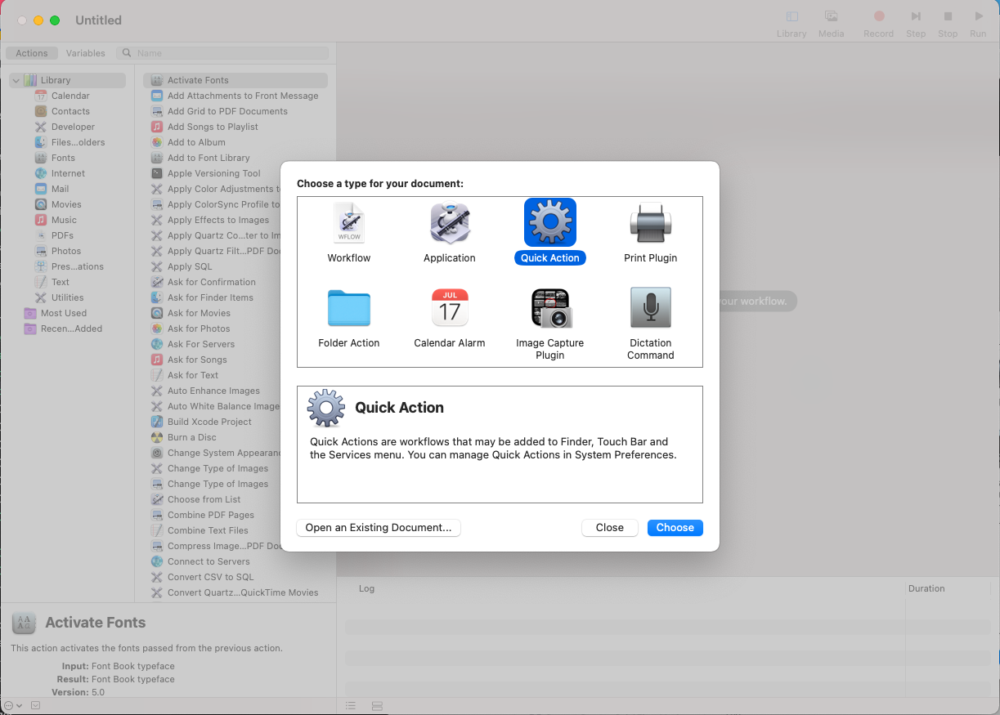
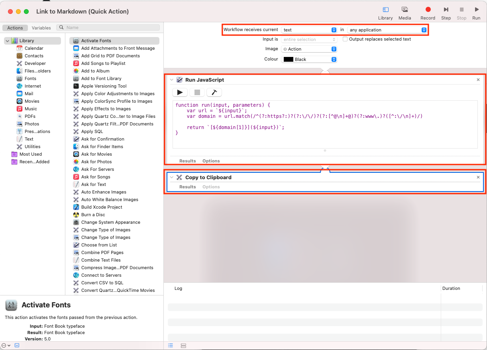

Recently I've been copying links from interesting pages and then adding them to a Markdown document in my [knowledge repo](https://github.com/m91michel/knowledge). My workflow is that I always have to format the link accordingly. Here is an example how a link looks like in Markdown:

```
Link: https://github.com/adam-p/markdown-here/wiki/Markdown-Cheatsheet
Output: [github.com](https://github.com/adam-p/markdown-here/wiki/Markdown-Cheatsheet)
```

I found this workflow annoying after some time, so I started looking for a solution and found Automator from Apple. This tool is built into macOS and allows you to run automation workflow. You can then a automation by a keyboard shortcut. In this blog post, I'll show you how you can also do that.

## Let's create the script
1. First open Automator by navigating to your application folder or by using Spotlight (`CMD + Space` and search for `Automator`)

2. Create new automation by selecting `Quick Action`.


4. Configure script settings
   - Workflow receives current: `text`
   - In `Any application`
5. Search for the `Run Javascript` action and drag it into the right corner
6. Search for `Copy to clipboard` action and drag after the javascript action
7. Add the javascript code

```
function run(input, parameters) {
	var url = `${input}`;
	var domain = url.match(/^(?:https?:)?(?:\/\/)?(?:[^@\n]+@)?(?:www\.)?([^:\/\n]+)/)
	
	return `[${domain[1]}](${input})`;
}
```
5. Safe the workflow with a nice name

## Execute that script by a shortcut


The final step is to configure a shortcut which executes the workflow.
1. Go to `Settings` -> `Keyboard` -> `Shortcuts`
2. Search by your workflow name and configure a key combination e.g. `^` + `ALt` + `CMD` + `C`

## Further ideas
- You can use approach to run any script for example post data to webhook.
- 
